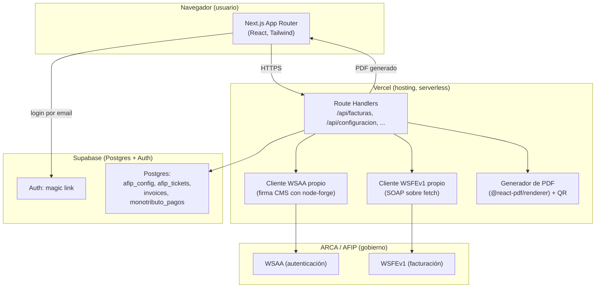

# Arquitectura de Fisca

Este documento explica **cómo está armado el sistema y por qué**, pensado
para alguien que necesita evaluarlo técnicamente (por ejemplo, antes de
comprarlo o invertir en él) o para quien construya la futura versión de
iOS y necesite entender qué reusar y qué no.

No es documentación de usuario — para eso está el `README.md`.

## 1. Qué es, en una frase

Una web app donde un monotributista carga un certificado digital de ARCA
una sola vez, y después emite Facturas C (con CAE real) desde un
formulario corto, sin pasar por ningún sistema contable ni por ningún
tercero que toque su clave privada.

## 2. Mapa del sistema

**Punto clave**: no hay ningún servicio de terceros entre esta app y ARCA.
El certificado y la clave privada del usuario nunca salen de las Route
Handlers de Vercel — ni al navegador, ni a ninguna otra empresa.

## 3. Stack

| Capa | Tecnología | Por qué |
|---|---|---|
| Frontend + backend | Next.js 16 (App Router), TypeScript, Tailwind | Un solo repo, route handlers como backend liviano, sin servidor propio que mantener |
| Hosting | Vercel | Deploy automático desde GitHub, gratis para este volumen |
| Base de datos + Auth | Supabase (Postgres) | Auth de email lista para usar, RLS de Postgres para aislar datos por usuario sin escribir esa lógica a mano |
| Integración fiscal | Cliente WSAA/WSFEv1 propio (`src/lib/afip/`) | Ver sección 5 — es la decisión de diseño más importante del proyecto |
| PDF | `@react-pdf/renderer` | Genera el PDF en el servidor, sin depender de un servicio externo |
| Cifrado en reposo | `node:crypto` (AES-256-GCM) | Nativo de Node, sin dependencias extra |

## 4. Modelo de datos

Cuatro tablas en Postgres, todas con **Row Level Security**: cada fila
solo la puede leer/escribir el usuario dueño (`auth.uid() = user_id`).
Esto es lo que garantiza que, si mañana usa la app más de una persona,
nadie puede ver los datos de otra ni manipulando la API directamente.

- **`afip_config`**: una fila por usuario — CUIT, punto de venta, ambiente
  (homologación/producción), certificado y clave privada **cifrados**.
- **`afip_tickets`**: cachea el Ticket de Acceso de WSAA (válido 12hs) para
  no pedir uno nuevo en cada factura.
- **`invoices`**: historial de comprobantes emitidos (Facturas C y Notas
  de Crédito), con el CAE, vencimiento, y una referencia opcional al
  comprobante que anulan.
- **`monotributo_pagos`**: solo para el recordatorio de pago — un check
  simple de "ya marqué este período como pagado", nada de dinero real
  pasa por acá.

## 5. La decisión de arquitectura más importante: WSAA/WSFE propio

ARCA expone dos webservices SOAP para facturar:

1. **WSAA**: autenticación. Se le manda un XML firmado (con el
   certificado del contribuyente) y devuelve un Token+Sign válido 12hs.
2. **WSFEv1**: con ese Token+Sign, pide el CAE de cada factura.

La librería más usada para esto en JS/TS, `@afipsdk/afip.js`, en su
versión actual **no habla directo con ARCA**: manda el certificado y la
clave privada del usuario a un servidor de un tercero (`app.afipsdk.com`)
para que ese tercero firme el WSAA por vos, y exige un `access_token` de
esa plataforma.

Para una app que maneja la clave fiscal de contribuyentes reales, ese
modelo de custodia por un tercero no es aceptable. Por eso `src/lib/afip/`
implementa el cliente desde cero:

- `wsaa.ts`: arma el XML (TRA), lo firma como CMS/PKCS#7 usando
  `node-forge` (JS puro, sin depender de un binario `openssl` externo), y
  llama directo al SOAP de WSAA.
- `ta-cache.ts`: cachea el Token+Sign en Postgres.
- `wsfe.ts`: llama a WSFEv1 (`FECompUltimoAutorizado`, `FECAESolicitar`)
  para Facturas C y Notas de Crédito C.
- `soap.ts`: parsea las respuestas SOAP (con `fast-xml-parser`) y traduce
  los errores de ARCA a mensajes legibles.

**Costo de esta decisión**: más código propio que mantener si ARCA cambia
algo en sus webservices (son estables, pero no inmutables). **Beneficio**:
la clave privada de cada usuario nunca la ve nadie más que ARCA.

## 6. Alcance deliberadamente acotado

Estas cosas fueron evaluadas y descartadas a propósito, no son un
"todavía no":

- **Factura D**: no existe como tipo de comprobante en ARCA.
- **Factura E (exportación)**: usa un webservice completamente distinto
  (WSFEXv1), fuera de alcance.
- **Pago automático del monotributo (VEP)**: no existe un webservice
  público para esto — solo hay un portal web interactivo. Automatizarlo
  requeriría manejar la Clave Fiscal real del usuario (no solo un
  certificado con permiso acotado), lo cual es un salto de riesgo que no
  se tomó. Lo que sí hay es un recordatorio + link directo a ARCA.
- **Clientes / Pedidos / Presupuestos**: convertiría esto en un sistema de
  gestión completo, en contra del objetivo original ("una sola pantalla
  para facturar rápido").

## 7. Qué necesitaría la versión de iOS

Dos caminos, sin necesidad de reescribir la integración con ARCA:

- **Camino corto (recomendado primero)**: nada de código nuevo — esta
  misma web app ya es responsive; se puede "instalar" desde Safari como
  ícono de pantalla de inicio (PWA). Cero costo, cero revisión de Apple.
- **Camino nativo**: una app Swift/SwiftUI que consuma los mismos
  `route handlers` de esta app (`/api/facturas`, `/api/configuracion`,
  etc.) autenticándose contra el mismo proyecto de Supabase. El cliente
  WSAA/WSFE y el cifrado de credenciales **no se tocan** — siguen viviendo
  en el servidor (Vercel), nunca en el dispositivo. La app de iOS sería
  básicamente una interfaz nueva sobre el mismo backend.

## 8. Seguridad, en resumen

- Login por magic link (Supabase Auth) — nada de contraseñas que
  gestionar.
- Aislamiento de datos por usuario a nivel de base de datos (RLS), no
  solo a nivel de código de la app.
- Certificado y clave privada cifrados en reposo (AES-256-GCM) con una
  master key que vive solo en variables de entorno del servidor.
- Ningún tercero en el medio de la comunicación con ARCA.
- Ambiente de homologación (testing) separado de producción, elegido por
  usuario — nunca se factura "de verdad" por accidente.
