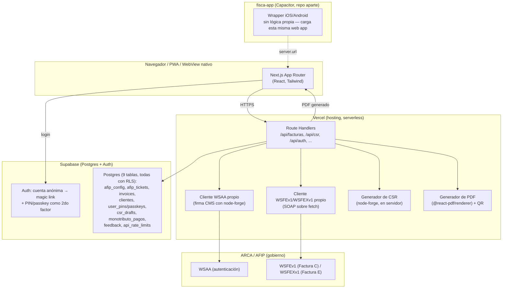

# Arquitectura de Fisca

Este documento explica **cómo está armado el sistema y por qué**, pensado
para alguien que necesita evaluarlo técnicamente (por ejemplo, antes de
comprarlo o invertir en él) o para quien siga trabajando en la app nativa
(`fisca-app`, §8) y necesite entender qué reusar y qué no.

No es documentación de usuario — para eso está el `README.md`.

## 1. Qué es, en una frase

Una web app donde un monotributista carga un certificado digital de ARCA
una sola vez (generándolo desde la misma app, sin OpenSSL), y después
emite Facturas C — y opcionalmente Factura E de exportación — con CAE
real desde un formulario corto, sin pasar por ningún sistema contable ni
por ningún tercero que toque su clave privada ni su clave fiscal.

## 2. Mapa del sistema

**Punto clave**: no hay ningún servicio de terceros entre esta app y ARCA.
El certificado y la clave privada del usuario nunca salen de las Route
Handlers de Vercel — ni al navegador, ni a ninguna otra empresa. Lo mismo
vale para la generación del certificado en sí (§6): ni siquiera hace
falta OpenSSL local.

## 3. Stack

| Capa | Tecnología | Por qué |
|---|---|---|
| Frontend + backend | Next.js 16 (App Router), TypeScript, Tailwind | Un solo repo, route handlers como backend liviano, sin servidor propio que mantener |
| Hosting | Vercel | Deploy automático desde GitHub, gratis para este volumen |
| Base de datos + Auth | Supabase (Postgres) | Auth lista para usar (anónima + email + RLS), sin escribir aislamiento por usuario a mano |
| Integración fiscal | Cliente WSAA/WSFEv1/WSFEXv1 y generador de CSR propios (`src/lib/afip/`, `src/lib/csr.ts`) | Ver sección 6 — es la decisión de diseño más importante del proyecto |
| Auth de segundo factor | PIN (scrypt) + passkeys/WebAuthn + biometría nativa (`@aparajita/capacitor-biometric-auth`) | Ver sección 5 |
| App nativa | Capacitor (repo `fisca-app` aparte) | Ver sección 8 — wrapper sin lógica propia, mismo backend |
| PDF | `@react-pdf/renderer` | Genera el PDF en el servidor, sin depender de un servicio externo |
| Cifrado en reposo | `node:crypto` (AES-256-GCM) | Nativo de Node, sin dependencias extra |
| Email transaccional | Resend (opcional) | Solo para copia por email del feedback in-app; la app funciona sin configurarlo |

## 4. Modelo de datos

Nueve tablas en Postgres (`supabase/migrations/0001` a `0009`), todas con
**Row Level Security**: cada fila solo la puede leer/escribir el usuario
dueño (`auth.uid() = user_id`). Esto es lo que garantiza que, con más de
una persona usando la app, nadie puede ver los datos de otra ni
manipulando la API directamente.

**Facturación (el núcleo)**

- **`afip_config`**: una fila por usuario — CUIT, punto de venta, ambiente
  (homologación/producción), certificado y clave privada **cifrados**.
- **`afip_tickets`**: cachea el Ticket de Acceso de WSAA (válido 12hs), uno
  por `service` (`wsfe` y `wsfex` son tickets separados — `0005_factura_e.sql`
  agregó esa columna al agregar Factura E).
- **`invoices`**: historial de comprobantes emitidos (Facturas C/E y Notas
  de Crédito), con el CAE, vencimiento, moneda/cotización, y una
  referencia opcional al comprobante que anulan.
- **`clientes`** (`0004_clientes.sql`): libreta de contactos — se
  autocompleta sola (`upsert` al emitir una factura, no un CRM manual) para
  no volver a tipear CUIT/nombre/condición IVA de un cliente ya facturado.
  Consumidor Final no se guarda (no tiene identidad que recordar).

**Onboarding y certificado**

- **`csr_drafts`** (`0007_csr_drafts.sql`): clave privada cifrada del CSR
  que generó el wizard, mientras la usuaria va y vuelve de ARCA con el
  `.crt` — ver §6.

**Autenticación (más allá del magic link)**

- **`user_pins`** (`0006_user_pins.sql`): PIN hasheado con scrypt, con
  bloqueo tras 3 intentos fallidos — segundo factor obligatorio.
- **`user_passkeys`** (`0006_user_pins.sql`): credenciales WebAuthn/Face ID
  para browser y PWA (contraparte del atajo biométrico nativo, que no usa
  esta tabla — ver §5).

**Producto, sin plata real de por medio**

- **`monotributo_pagos`**: solo para el recordatorio de pago — un check
  simple de "ya marqué este período como pagado".
- **`feedback`** (`0008_feedback.sql`): mensajes del formulario in-app,
  solo insert desde la app (se leen desde el dashboard de Supabase, o
  llegan por email si hay Resend configurado).

**Infraestructura**

- **`api_rate_limits`** (`0009_rate_limits.sql`): rate limiting persistente
  por usuario y endpoint — hace falta una tabla porque el entorno
  serverless no tiene memoria compartida entre invocaciones.

## 5. Autenticación multicapa

No es "solo magic link" — son cuatro piezas que se combinan según el
momento y la plataforma:

1. **Entrada trial-first**: `/signup` crea una **cuenta anónima de
   Supabase** (`signInAnonymously()`) antes de pedir ningún dato — se
   puede recorrer la app sin comprometerse a un email. `/vincular` es el
   wizard de 5 pasos (email → PIN → confirmar PIN → Face ID opcional →
   mail enviado) que asocia esa cuenta anónima a un email real.
2. **Login recurrente**: magic link (`signInWithOtp`) con un
   `emailRedirectTo` que cambia según la plataforma — `fisca://auth-callback`
   dentro del shell nativo de Capacitor (detectado con
   `window.Capacitor.isNativePlatform()`), o `/auth/callback` en
   browser/PWA (`src/app/login/page.tsx`).
3. **Segundo factor obligatorio tras el link**: `/desbloquear` con
   `fromLogin=1` siempre pide **PIN** (tabla `user_pins`, hash scrypt +
   comparación a tiempo constante, `src/lib/pin.ts`) — nunca biometría acá,
   el PIN es el factor real. En aperturas posteriores de la app (sin
   `fromLogin`), la biometría se intenta primero como atajo y cae a PIN si
   falla o no está enrolada.
4. **Biometría con estrategia dual** (`src/lib/biometric.ts` decide en
   runtime cuál usar, el resto de la app no lo sabe):
   - **Nativo** (dentro de `fisca-app`/Capacitor):
     `@aparajita/capacitor-biometric-auth` — Face ID/Touch ID/huella
     directo del SO, sin necesitar Associated Domains.
   - **WebAuthn/Passkey** (browser o PWA):
     `src/lib/webauthn.ts` + `src/lib/passkey-client.ts`, tabla
     `user_passkeys` — el mismo Face ID/Touch ID pero vía la API estándar
     del navegador, para cuando no hay shell nativo.

Recuperación de PIN vía `/reset-pin` + `api/auth/pin/recover` /
`api/auth/pin/reset` (rate-limited, ver `SECURITY.md`).

## 6. La decisión de arquitectura más importante: WSAA/WSFE propio

ARCA expone dos familias de webservices SOAP para facturar:

1. **WSAA**: autenticación. Se le manda un XML firmado (con el
   certificado del contribuyente) y devuelve un Token+Sign válido 12hs —
   uno por cada servicio (`wsfe`, `wsfex`) que se quiera usar.
2. **WSFEv1** (mercado interno, Factura C) y **WSFEXv1** (exportación,
   Factura E): con ese Token+Sign, piden el CAE de cada factura. Son dos
   webservices con esquemas de datos distintos, no una variante del otro.

La librería más usada para esto en JS/TS, `@afipsdk/afip.js`, en su
versión actual **no habla directo con ARCA**: manda el certificado y la
clave privada del usuario a un servidor de un tercero (`app.afipsdk.com`)
para que ese tercero firme el WSAA por vos, y exige un `access_token` de
esa plataforma.

Para una app que maneja la clave fiscal de contribuyentes reales, ese
modelo de custodia por un tercero no es aceptable. Por eso `src/lib/afip/`
implementa el cliente desde cero:

- `wsaa.ts`: arma el XML (TRA), lo firma como CMS/PKCS#7 usando
  `node-forge` (JS puro, sin depender de un binario `openssl` externo), y
  llama directo al SOAP de WSAA.
- `ta-cache.ts`: cachea el Token+Sign en Postgres, por `service`.
- `wsfe.ts`: llama a WSFEv1 (`FECompUltimoAutorizado`, `FECAESolicitar`,
  `FEParamGetCotizacion`) para Facturas C, Notas de Crédito C, y la
  cotización oficial para facturar en moneda extranjera (RG 5616/2024).
- `wsfex.ts`: lo mismo pero contra WSFEXv1, para Factura E.
- `soap.ts`: parsea las respuestas SOAP (con `fast-xml-parser`) y traduce
  los errores de ARCA a mensajes legibles.

La misma filosofía se extiende a la generación del certificado en sí
(`src/lib/csr.ts`): en vez de pedirle a la usuaria que instale OpenSSL y
genere su CSR/clave privada a mano, el servidor genera el par RSA-2048 y
el CSR (PKCS#10) con `node-forge`, guarda la clave cifrada en
`csr_drafts` mientras la usuaria va a ARCA a buscar el `.crt`, y verifica
al volver que ese `.crt` corresponda exactamente a la clave que generó
(`certificateMatchesKey`) antes de aceptarlo.

**Costo de esta decisión**: más código propio que mantener si ARCA cambia
algo en sus webservices (son estables, pero no inmutables), y ahora el
doble (WSFEv1 + WSFEXv1). **Beneficio**: la clave privada de cada usuario
nunca la ve nadie más que ARCA, ni siquiera durante su generación.

## 7. Alcance deliberadamente acotado

Estas cosas fueron evaluadas y descartadas a propósito, no son un
"todavía no":

- **Factura D**: no existe como tipo de comprobante en ARCA.
- **Factura A/B**: legalmente reservadas a responsables inscriptos, no a
  monotributistas.
- **Pago automático del monotributo (VEP)**: no existe un webservice
  público para esto — solo hay un portal web interactivo. Automatizarlo
  requeriría manejar la Clave Fiscal real del usuario (no solo un
  certificado con permiso acotado), lo cual es un salto de riesgo que no
  se tomó. Lo que sí hay es un recordatorio + link directo a ARCA.
- **CRM de clientes / Pedidos / Presupuestos**: la tabla `clientes` que sí
  existe (§4) es una libreta liviana que se autocompleta sola al
  facturar, no algo que se edite a mano ni un sistema de gestión — eso
  seguiría convirtiendo esto en algo más grande, en contra del objetivo
  original ("una sola pantalla para facturar rápido").

**Ya no está fuera de alcance** (para no repetir el error de dar por
"descartado" algo que después se construyó): **Factura E** de
exportación sí se construyó — es un formulario y webservice aparte
(§6), no una extensión de Factura C.

## 8. La app nativa (iOS/Android) — ya no es una decisión futura

La versión anterior de este documento presentaba la app nativa como una
elección pendiente entre PWA o Swift/SwiftUI. Esa decisión ya se tomó y
se ejecutó parcialmente: **Capacitor**, en un repo aparte (`fisca-app`,
hermano de este).

- **`fisca-app` es un wrapper puro, no una reescritura**: su
  `capacitor.config.ts` apunta `server.url` directo a
  `https://fisca.vercel.app` — carga esta misma web app dentro de un
  WebView nativo. No tiene lógica de facturación propia, ni un cliente
  WSAA/WSFE del lado del dispositivo. La integración con ARCA y el
  cifrado de credenciales **siguen viviendo enteramente en este repo**
  (Vercel), igual que si fuera PWA.
- Lo único nativo de verdad es: los plugins de Capacitor (biometría vía
  `@aparajita/capacitor-biometric-auth`, `@capacitor/app`,
  `@capacitor/browser`), íconos/splash, y la resolución del deep link
  `fisca://auth-callback` para que el magic link reabra la app instalada
  en vez del browser del sistema (ver §5, punto 2).
- La PWA (`src/app/manifest.ts`, "agregar a inicio" desde Safari) **no se
  reemplazó** — conviven las dos formas de instalar la app; Capacitor es
  la que permite biometría nativa y presencia en las stores más adelante.
- **Estado actual** (bundle id `ar.malenitaa.fisca`): repo recién
  arrancado, Face ID probado funcionando en iOS, permiso de biometría
  agregado en el manifest de Android pero sin probar en dispositivo
  todavía, sin publicar en App Store/Play Store.

## 9. Seguridad, en resumen

Ver **`SECURITY.md`** para el detalle control por control (tabla OWASP
Top 10, rate limits por endpoint, limitaciones conocidas). En resumen:

- Entrada sin fricción (cuenta anónima) + magic link + PIN obligatorio +
  biometría opcional como atajo — nada de contraseñas que gestionar.
- Aislamiento de datos por usuario a nivel de base de datos (RLS), no
  solo a nivel de código de la app.
- Certificado y clave privada cifrados en reposo (AES-256-GCM) con una
  master key que vive solo en variables de entorno del servidor — y ahora
  ni siquiera se generan fuera de ese perímetro (§6).
- Ningún tercero en el medio de la comunicación con ARCA.
- Ambiente de homologación (testing) separado de producción, elegido por
  usuario — nunca se factura "de verdad" por accidente.
- Rate limiting persistente (Postgres) en los endpoints sensibles —
  necesario porque el entorno serverless no tiene memoria compartida.
